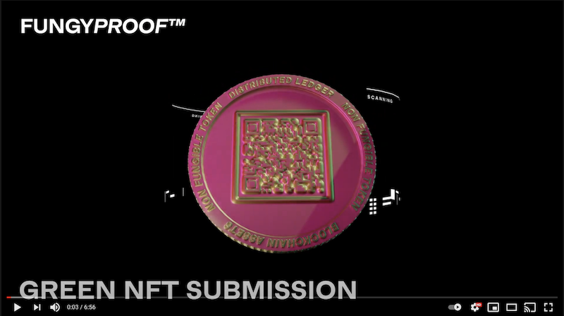
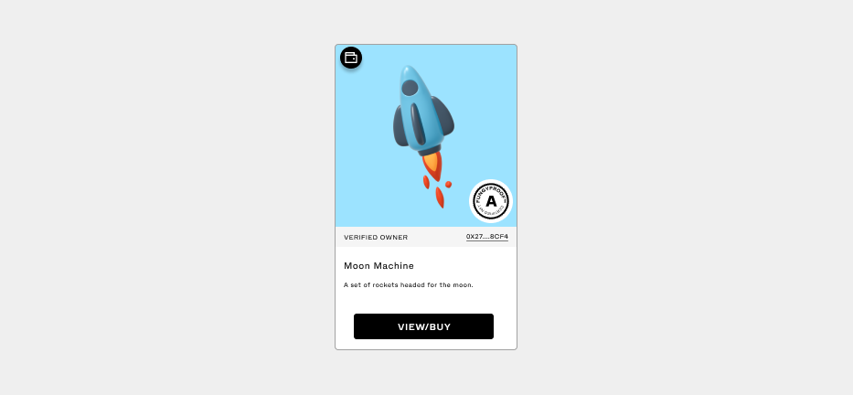
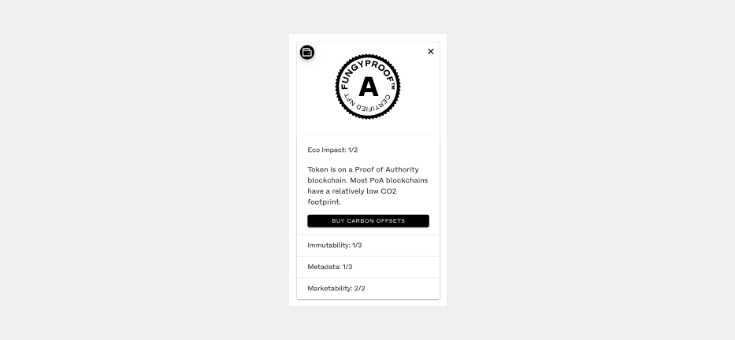
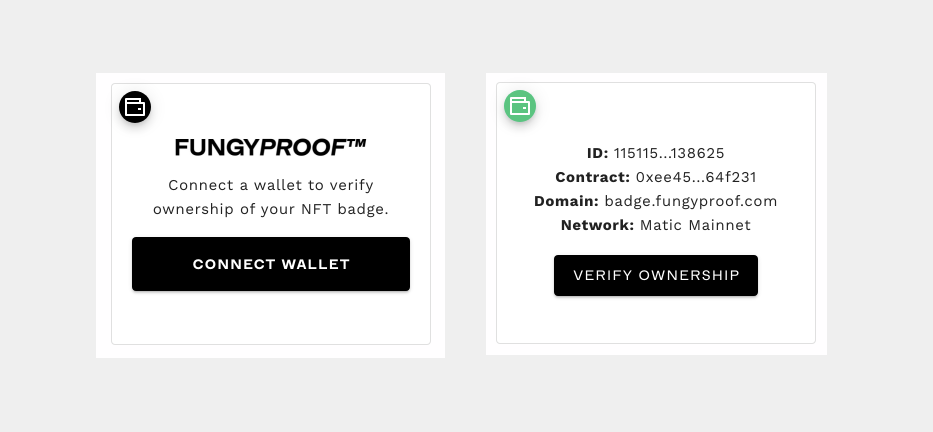

An embeddable badge for token holders and token creation platforms which enables the display of an NFTs Eco Impact, Immutability, Metadata, and Marketability grade using signed validation of token/contract ownership.

https://badge.fungyproof.com

---

This work was originally done for the [Green NFT Hackathon: Solutions Prize Bounty](https://gitcoin.co/issue/GreenNFT/GreenNFTs/1/100025260).

Submitted: 05/06/2021

Authors: Mike Roth, Brandon Roth


## Watch Demo

[](https://www.youtube.com/watch?v=fFuX7nSdXeI)


## Usage

**Installation**

To add a badge to a page include the following script and html tag in your page. 

_TIP: you can include more than one html tag to embed multiple tokens._

```html
<script src="https://funyproof.com/badge.js" />
<fungy-proof-badge contract="0x2352525..." token-id="12" network-id="4" />
```

**Display**

The badge displays the token and it's grade by default.



**Grade**

Clicking on the tokens grade displays the results of the grade and each category. An option to bounce to Offsetra to purchase carbon offsets for the NFT is available under the Eco Impact results.



**Verification**

To certify ownership of a token. Connect a wallet (Metamask only for now) and sign a message. The wallet/address must be the owner of the NFT and the certification will only be valid for the current domain.

Once a token is verified, future views of the badge will display the tokens verified owner.



---

## Contributing

```
yarn install
```

### Compiles and hot-reloads for development
```
yarn serve
```

### Compiles and minifies for production
```
yarn build
```

### Run your unit tests
```
yarn test:unit
```

### Run your end-to-end tests
```
yarn test:e2e
```

### Lints and fixes files
```
yarn lint
```
