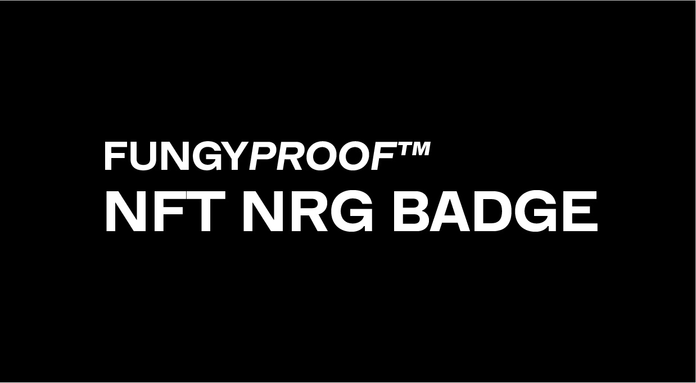

Create an embeddable badge for token holders and token creation platforms which allows them to display their Eco Impact grade using signed validation of token/contract ownership.

## Usage

[WIP]

---

```html
<script src="https://funyproof.com/badge.js">
<div id="fp-badge" data-contract="0x2352525" data-id="12">
```


## Contributing
```
yarn install
```

### Compiles and hot-reloads for development
```
yarn serve
```

### Compiles and minifies for production
```
yarn build
```

### Run your unit tests
```
yarn test:unit
```

### Run your end-to-end tests
```
yarn test:e2e
```

### Lints and fixes files
```
yarn lint
```
